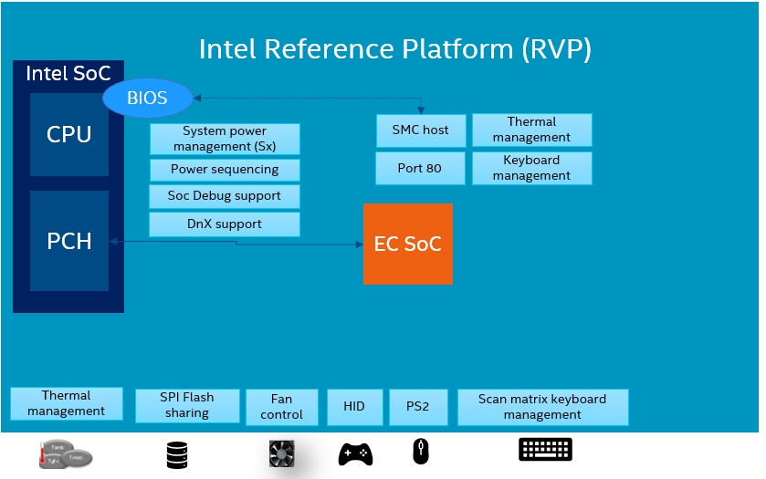

.. introduction:

Project overview
################

.. contents::
    :local:
    :depth: 3

The Embedded Controller firmware (EC) in a system, handles various low-level tasks
not performed by the operating system like board power sequencing, battery
management, thermal management, keyboard management, LAN, PCIe reset etc.

Intel Basic Embedded Controller firmware provides reference code with a subset
of such capabilities.

.. image:: embedded_controller.png
  :align: center

IA system designers, OEMs can leverage the Intel open source EC FW code to use
as a base and customize for the system requirements.
The reference code covers all the basic EC functionality required to boot
Enhanced Serial Peripheral Interface (eSPI) enabled platforms.”

The reference code will also demonstrate the 3rd party microcontroller role in
common platform boot sequence as well as the interaction with Intel BIOS.
Finally, it showcases the management of PC peripherals such as PS/2 devices
and matrix keyboards.

Dependencies
============
The reference embedded controller firmware is based on `Zephyr RTOS`_, this
repository contains only the application source code as depicted below,
so it must be combined with Zephyr RTOS and the respective EC SoC Board Support
Package (BSP) and Hardware Abstraction Layer (HAL).

.. image:: ecfw_zephyr_modules.png
  :width: 600px
  :align: center

Repository Management
=====================
In order to manage the combination of the above repositories and versions, this
project uses `Zephyr's west`_ (Zephyr’s meta-tool).

The main repository contains a manifest file (west.yml), that list all the
dependencies and revisions required for each of the external projects.

This means the main repo acts as the manifest repository.

.. image:: ecfw_zephyr_repos.png
  :align: center

You can find additional information about the repository management and west
manifest in `Zephyr's west manifest`_.

.. _Zephyr RTOS:
   https://www.zephyrproject.org/

.. _Zephyr's west:
   https://docs.zephyrproject.org/latest/develop/west/index.html

.. _`Zephyr's west manifest`:
   https://docs.zephyrproject.org/latest/develop/west/manifest.html

.. _Enhanced Serial Peripheral Interface:
    https://www.intel.com/content/dam/support/us/en/documents/software/chipset-software/327432-004_espi_base_specification_rev1.0_cb.pdf
