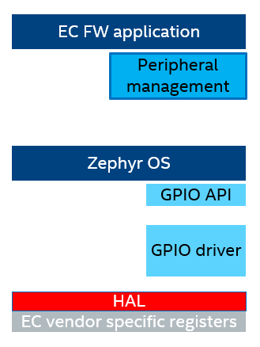
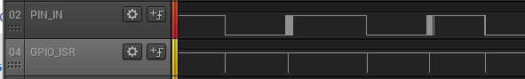

.. _human_interface_devices:

Peripheral management
#####################

.. contents::
    :local:
    :depth: 1

This section describes the Embedded Controller human interface device management
module, which mainly handles buttons and switches associated with human interaction.

Windows Button Support
**********************

* Power button

  The power button input to EC is by default driven HIGH with a pull-up.
  On power button press this line will be pulled LOW which triggers interrupt.

* Volume up/down buttons

* Home button

Switches (when applicable)
**************************

* Laptop lid

* Screen rotation lock

This module is used to track the state of switches and notifies other modules
when a state change occurs in any of them.

- Button (press, released)
- Switch (open, closed)

The main role of this module is to deal with the undesirable effect that any
mechanical switch has whenever it bangs together causing electrical rebound
before settling down after the electrical transient time.

  .. image:: switch_transient.png
     :align: center

Therefore, this module is mainly involved in removing these undesired changes
or debouncing.

.. note::
  Disable this module if your board already has debouncing by hardware.

Implementation
==============
Mechanical switch debouncing is implemented using cooperative threading to
track the state transitions from all buttons registered within the system.

This module uses a cooperative thread to track the state transitions from all
buttons registered within the system.

Callbacks per button/switch are registered within the GPIO driver to track
different state transitions for button and switches.

.. note::
  This module assumes that the gpios connected to buttons or switches are already
  configured during board initialization as input. It also assumes that interrupt
  for changes in the state is enabled and configured to trigger on both edges.

When the GPIO driver notifies this module of a GPIO level change in either direction,
the pin is moved into "debouncing" state. Once the button is debounced,
the pin is moved back to 'stable' state.

The state of a button/pin changes from debouncing to stable state by means of a
counter. Once the debounce process begins, a counter is increased every
millisecond.  If the counter reaches zero without any additional level change,
it means the "bouncing" or electrical transient period is considered over.
This results in a state transition out of "debouncing" state and their
respective observers are notified.

Before the counter expires, if there is another callback indicating a change
on the pin, the counter is reset back to maximum DEBOUNCE_TIME and the pin continues
debouncing.

  .. image:: peripheral_implementation.png
     :align: center

.. note::
  This module considers that most buttons or switches won't exhibit bouncing
  with a duration exceeding 5 milliseconds, hence DEBOUNCE_TIME is set to 5.

Additionally, in order to handle cases where circuit is too noisy, the module
filters events and only notifies the observers only when an actual change has
occurred.
