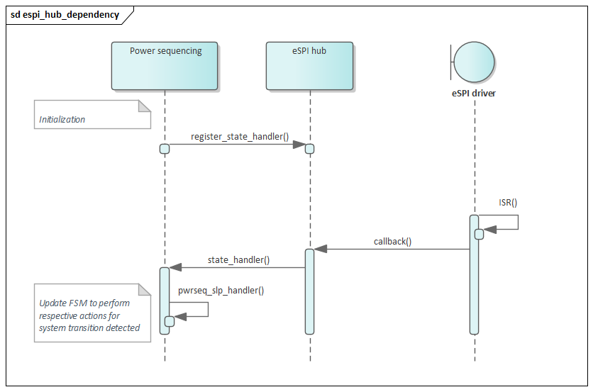

.. _power_sequencing:

Power Sequencing
################

.. contents::
    :local:
    :depth: 1

This section describes the embedded controller firmware power sequencing module
which handles platform out-of-reset sequencing and power management flows.

The embedded controller firmware follows Intel `Platform design guide`_
for all power sequencing timings and sequence.
This module relies on platform events to keep track of these system transitions.
These power signals either come from a host system (Intel SoC) or are generated
by board circuitry.

.. note::
  System in this case refers to either board, laptop or desktop running Windows OS,
  however some concepts are generic enough to be applicable to other OS.

Power Signals
=============

Power button input
------------------
Also known as SMC_ONOFF, refers to the direct connection to EC from the board
power button. Based on this signal the module generates a debounced or delayed
power button signal towards Intel PCH as described in the `Platform design guide`_.

RSMRST#_PWRGD
-------------
Resume reset power good signal to the Embedded Controller hardware to indicate
that main power rails on the board are stable, in response this module generates
RSMRST output to PCH.

ALL_SYS_PWRGD
-------------
The all system power good input generated from board circuitry indicates to
the Embedded Controller (EC) that SoC power rails are stable. Based on this
the module will generate PCH_PWROK signal.

SLP_Sx#
-------
SLP_S3#, SLP_S4# and SLP_S5# indicate that the host system is undergoing a system
transition, in which case system is entering the specified sleep state indicated
by the respective signal as defined in `ACPI specification`_.

.. note::
  The power signals can either be physical pins or virtual pins which are
  transmitted over the eSPI bus in the form of a virtual wire. The reference code
  assumes an eSPI-capable host. See `Enhanced Serial Peripheral Interface specification`_

System transitions
==================

This module main role is to handle system transitions between the global system
states (Gx states) defined `ACPI specification`. The states apply to the system
as a whole and are visible to the user.

  .. image:: system_transitions.png
     :align: center

.. note::
  Windows OS is assumed in Intel TGL RVP, in which case Gx states map to user
  actions as follows: suspend (S3), hibernate (S4), shutdown (S5).

ACPI System Transitions
=======================

Flow for G3 to S0
-----------------
Trigger events

* Valid power button press
* Platform sleep signal assertion

Actions

1) Check for any power button press
2) Check RSMRST_PWRGD input
3) Generate RSMRST#
4) Propagate power button status to PCH
5) Perform deep sleep exit handshake if supported
   a) PCH sends SUS_WRN virtual wire
   b) EC acknowledges by sending SUS_ACK virtual wire
6) Indicate if there is a valid power source or enough battery capacity to power up the system using PM_BATLOW signal.
7) Check power sequencing signals as described in the platform guide. These include SLP_S5, SLP_S4, SLP_S3 and SLP_M (sometimes referred as SLP_A).
8) Wait for ALL_SYS_PWRGD
9) Drive PCH_PWROK and if required by the system SYS_PWROK.
   Do refer to platform guide to see if this signal needs to be generated.
10) Wait for platform reset signal.

  .. image:: power_signals.png
     :align: center

Flow for S0 to S3 (suspend)
---------------------------
Trigger events:

* SLP_S3 signal assertion

Actions:

* Turn off 7-segment display used for platform POST codes
* Turn off system fan
* Wait for event for resume

Flow for S3 to S0 (resume)
--------------------------
Trigger events:

* SLP_S3 signal de-assertion
* Power button
* AC adaptor insertion or removal

Flow for S0 to S4/S5 (hibernate/shutdown)
-----------------------------------------
Trigger events:

* Respective sleep signal de-assertion (SLP_S4 or SLP_S5)

Actions:

* Turn off 7-segment display used for platform POST codes
* Turn off system fan
* Reconfigure GPIOs for power saving
* Remove PCH_PWROK signal

Flow for S5/S4 to S0
--------------------
Trigger events:

* Respective sleep signal de-assertion (SLP_S4 or SLP_S5)

Actions:

* Turn on 7-segment display used for platform POST codes
* Turn on system fan
* Reconfigure GPIOs to previous state prior to transition.
* Provide PCH_PWROK signal

Intel-specific Power Management Transitions
===========================================
There are 2 additional low power states supported in some platforms which reduce
power consumption further from S3/S4/S5 global states described in ACPI spec.

The implementation of these consider 2 different cases:

* Embedded controller losing power after deep sleep entry
* Embedded controller not losing power after deep sleep entry

For the case where Embedded Controller loses power during the transition,
EC_DSx# signal is used keep EC on/off during system deep sleep.

.. note::
  Deep sleep for S3 is not supported in this reference implementation.

Flow for S3/S4/S5 to deep sleep
-------------------------------
Pre-condition:

* System is already in S3/S4/S5

Triggers:

* SUS_WRN power signal assertion is received.

Actions:

* Module acknowledges notification by sending SUS_ACK
* Module waits for PCH PM_SLP_SUS# assertion
* Module asserts RSMRST#

Flow for deep sleep to S3/S4/S5
-------------------------------
Triggers:

* EC wakes via power button

Actions:

* Module de-asserts RMSRST#
* Module waits for SUS_WARN de-assertion.
* Module acknowledges notification by sending SUS_ACK

.. note::
   Once system is back to regular sleep states, EC FW waits for SLP_Sx# signals
   then follows normal S3 to S0 or S4/S5 to S0 flow.

.. note::
   If EC HW main power rail was off during entry to deep sleep, EC FW will
   perform same flow G3 to S0 after SUS_WRN handshake describe earlier.

Implementation
==============
This module uses a cooperative thread as described in the task handling section.
The thread track overall system transitions then sleeps 10 ms before checking again
for new events.

To track the different triggers the power sequencing module registers for
notifications with the `eSPI hub` and whenever there is a relevant virtual wire
event, the new system state is determined, and actions as described above are
executed.

.. note::
  Previous reference designs did rely on physical pins instead of eSPI Virtual Wires.

Timeout Mechanism
=================
Each transition is triggered by a specific event and before the transition
is completed, the module will check if certain conditions are met, if any
each of these conditions is not fulfilled within a predetermined time interval
the power sequencing will stop.

Such scenario is considered a power sequencing failure, so RSMRST# signal will
be pulled LOW as required by platform design guide and a timeout code will be
displayed in postcode display in the following format "ECNN", where NN refers
to a specific error code.

Variants Across Platforms
=========================
This module covers generic aspects of power sequencing, however for specific timings
and/or signals not covered here refer to your Intel PCH specific `Platform design guide`_.

.. _Platform design guide:
    https://www.intel.com/content/www/us/en/programmable/documentation/lit-index.html
.. _Enhanced Serial Peripheral Interface specification:
    https://www.intel.com/content/dam/support/us/en/documents/software/chipset-software/327432-004_espi_base_specification_rev1.0_cb.pdf
.. _ACPI specification:
    https://uefi.org/sites/default/files/resources/ACPI_6_3_final_Jan30.pdf
