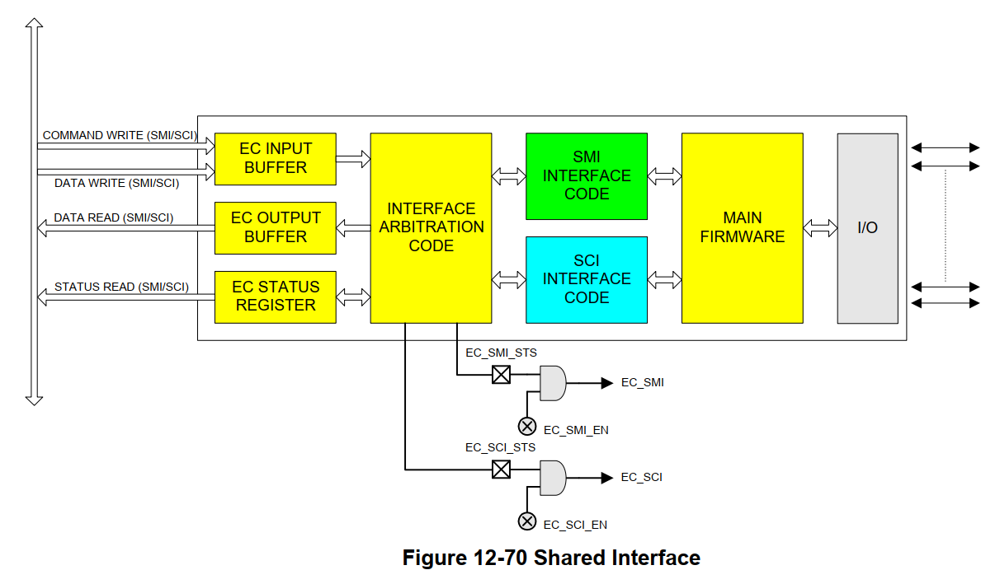
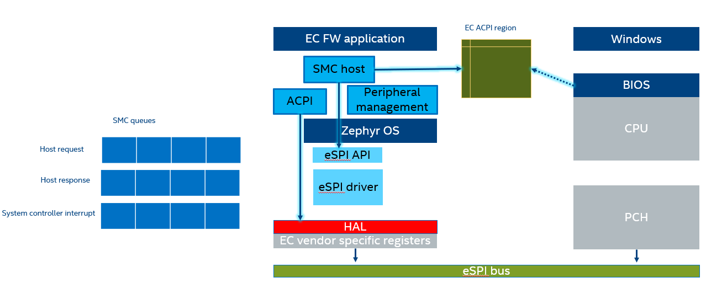

.. _smc:

System Management Controller
############################

.. contents::
    :local:
    :depth: 1

There are several forms of communication between the Embedded Controller and
Intel SoC in the system including ACPI, System Management Bus (SMBus), or
shared memory.
The sections details how the reference code implements the interfaces
described in the `ACPI specification`_ Chapter 12, to enable communication
between the Embedded Controller and BIOS/OS.

This include communication in both directions. Either initiated by BIOS/EC where
EC is queried to obtain system information within EC domain (battery, thermal,
fan, and so on). Or initiated by EC when a system event detected needs to
be notified to OS (button press, thermal event).

This section also describes how this communication mechanism can be extended or
modified.

HW interface
*************
The most common Embedded Controllers include a host interface that physically
connects the EC HW to the SoC host bus and allows a bidirectional communication.
Similarly, it supports a bidirectional event mechanism that allows EC to
"interrupt" the SoC and vice versa.

The most common host interface architecture in microcontrollers is depicted
in `ACPI specification`_ Figure 12-70. The figure depicts the interrupts and
the ports or 'ranges' used by the register interface for communication.

Note that as described in the ACPI specification, there are 2 registers in the
interface. EC_SC acts as a status register when read and as command when written.
On the other hand, EC_DAT is used to exchange data in both directions.

Operations over these registers are frequently emulated/tunneled through a
physical bus. See `LPC specification`_, Section 11.2

SW flow
*******
In a nutshell the above register interface is used by BIOS and OS to interact
with the EC as depicted below. Refer to `ACPI specification`_ Section 12.2 for
more details.

When BIOS write to EC_SC one of the predefined values (0x80-0x84) to indicate
EC to perform an operation it does using I/O ports 0x66 and 0x62.

.. note:: In eSPI-enabled system, when the host perform operations over 0x66 and
          0x62, the traffic is tunneled over eSPI.

The sequence for predefined EC command processing is as follows:

1) Host wait for IBF flag on status register to be 0, which indicates interface is free.
2) Host write to command byte to port 66.
3) While the transaction is outgoing
   3a) Wait until IBF flag becomes 0 again
   3b) Write data or address byte to port 62.
4) To receive data from EC
   4a) Wait for OBF flag to be 1, which indicates there is incoming data.
   4b) Read data byte from port 62.

Implementation
**************
The SMC host module is implemented as a cooperative thread that registers multiple
callbacks within different modules to track event in the system.

The most relevant notifications are:

1) BIOS/EC commands

* Host has sent data or command over eSPI bus using HW interface previously described.

2) Peripheral notifications

Used to be aware of any human interaction with the system that need to be
notified to the BIOS/OS.

3) Host warning notifications

Host has issued a warning for an upcoming platform or host reset.

.. note: This notification is particularly important in this module to adhere to
         eSPI specification guideline, which indicates that no virtual wire
         should be transmitted after platform reset is received.

Queue Mechanism
===============
The thread performs periodic checks on above notifications to handle
all operations outside of ISR/callback context it follows same pattern as all
other tasks where upon notification.

This module uses 2 queues one for incoming data and for outgoing data. A third
queue is used to schedule system interrupt notifications towards BIOS/OS.

.. note:  The current SMC host module implement uses ACPI driver that abstract
          the ACPI register interface. Nevertheless, this access SoC-specific
          HW registers.
          In upcoming releases the ACPI interface should be and extension of the
          corresponding bus where traffic is tunneled i.e. the eSPI bus.

SCI Notifications
=================
In several scenarios, EC is responsible to notify BIOS/OS about asynchronous event
in the system, EC modules do enqueue different notifications.

.. note:: As mentioned before, in eSPI-enabled platform the register interface
          traffic is tunneled eSPI bus peripheral channel. Similarly, the System
          Controller Interrupt pin level is transmitted as eSPI virtual wire.
          Main implication is that SCI queue should be flushed whenever there is
          a platform reset event.

ACPI Region
===========
ACPI standard supports multiple embedded controller in a system, each with
its own addressable I/O space or EC ACPI region. Nevertheless, reference HW
only has one instance. The region is defined in BIOS ACPI tables and this module
defines a memory region that matches byte per byte the fields in that table.

BIOS runtime does implement ACPI methods that request EC read/write operations
over this region. i.e. battery status.

Custom EC Commands
==================
EC FW framework does extend the command interface defined in ACPI specification
to enrich BIOS-EC interaction communication. These custom commands are defined
under smchost_codes.h

.. note:  The current smchost commands list includes only the minimum commands
          Intel BIOS expects to boot platform.
          OEMs can extend this list as part their customization.

.. note: Some of these custom commands may require additional processing, in such case
         this module propagates the request to other modules within the EC framework and
         completes the command immediately.

.. _Platform design guide:
    https://www.intel.com/content/www/us/en/programmable/documentation/lit-index.html
.. _Enhanced Serial Peripheral Interface specification:
    https://www.intel.com/content/dam/support/us/en/documents/software/chipset-software/327432-004_espi_base_specification_rev1.0_cb.pdf
.. _ACPI specification:
    https://uefi.org/sites/default/files/resources/ACPI_6_3_final_Jan30.pdf
.. _LPC specification:
   https://www.intel.com/content/dam/www/program/design/us/en/documents/low-pin-count-interface-specification.pdf