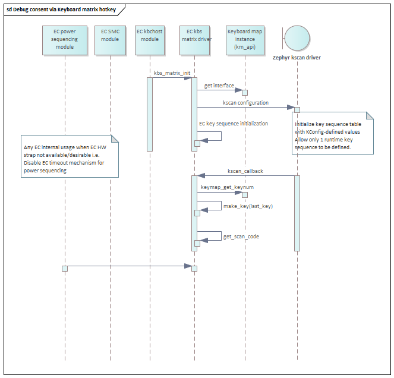
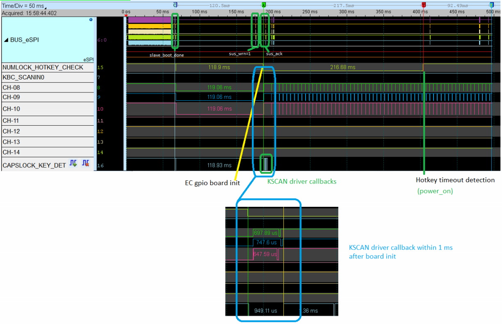

.. _ec_debug_awareness:

EC support for Intel SoC Debug
##############################

.. contents::
    :local:
    :depth: 3

Overview
********

This application note describes the requirements and implementation details for
EC FW to avoid disruption Intel SoC debug tools. It covers an overview of the
current constraint, EC role in SoC debug flows and recommended implementation
as well as a set of optional features to provide flexibility.

SoC debug while EC timeout is enabled
=====================================
As indicated in Intel `EC FW reference documentation`_, during system
transitions (boot, resume, hibernate, shutdown) EC will check if certain
conditions are met, if any of these conditions is not fulfilled within a
predetermined time interval the power sequencing will stop and timeout.

Whenever Intel/OEM/ODMs connect a debug tool and change the boot flow (and
intentionally stop the power sequencing in early stages), EC (WDT) reset the
platform.

 - Connecting a debug tool/cable
 - Loading tokens or authenticating to enable Intel/OEM debug
 - Collecting and extracting emergency trace and crash log
 - OEM/ODM manufacturing floor bone-pile triage, RMA triage
 - IA run-control

Internally, Intel RVP has EC WDT disable jumper which allows to prevent this
disruption; however, this is not appropriate for production or closed chassis
systems.

  .. image:: soc_debug_consent_jumper.png
     :align: center

EC SoC-debug awareness
**********************
EC will become SoC-debug aware when debug Consent is communicated, when debug
is enabled, EC WDT must be disabled to allow debug tool to perturb the normal
operation at any time, in any power-state.

SoC-debug consent via SoC bootstall GPIO
========================================

Intel recommends communicating the debug consent/intention physically to EC
via SoC bootstall pin, so the debug tool perform this action.
This is same pin where PMC_GPIO jumper is connected in Intel RVPs

  .. image:: soc_debug_consent_soc_gpio.png
     :align: center

At difference than existing implementation which samples the PMC_GPIO pin only
once at boot, in this case EC power sequencing module will register for
notifications so whenever there is a change in SoC bootstall, EC will
re-evaluate if EC WDT has to be disabled or not.

  .. image:: soc_debug_consent_soc_gpio_flow.png
     :align: center

Considerations
--------------
Special attention should be paid to any timeout loop to avoid race conditions
and ensure PMC_GPIO update it is always processed.

  .. image:: soc_debug_consent_soc_gpio_considerations.png
     :align: center

Optional extensions
-------------------
In addition, to disable EC WDT mechanism, a debug consent flag could be saved
in non-volatile memory, so the EC WDT remains disable across power cycles.

If this is not implemented, if EC timeout mechanism is disabled or not will
follow if PMC_GPIO (Timeout disable HW strap state) on next power cycle.

If this is implemented in any extension of existing code, flag should be cleared
whenever PMC_GPIO becomes HIGH for predetermined amount of time.

Whenever available SoC bootstall GPIO is the preferred method to disable
EC WDT, but if that's not available below are list of alternatives.

+---------------+--------+----------+----------------------------------+
| SoC bootstall | EC WDT | Keyboard |                                  |
|               | jumper |  matrix  | Debug consent communication      |
+===============+========+==========+==================================+
|      Yes      |   x    |    x     | SoC-GPIO                         |
+---------------+--------+----------+----------------------------------+
|      No       |  Yes   |    x     | PMC-GPIO                         |
|               |        |          |                                  |
+---------------+--------+----------+----------------------------------+
|      No       |  No    |  Yes     | Hotkey sequence prior to power up|
+---------------+--------+----------+----------------------------------+

SoC-debug consent via Keyboard matrix hotkey
============================================

For closed-chassis systems without SoC GPIO bootstall support that have matrix
keyboard attached, EC ODM can define a hotkey that when pressed will disable
the EC WDT.

The Intel Zephyr-based EC FW reference code for TGL + MECC has this feature
enabled by default.

Refer to prj_mec1501modular_assy6885.conf

.. code-block:: bash

   CONFIG_EARLY_KEY_SEQUENCE_DETECTION=y
   CONFIG_POWER_SEQUENCE_DISABLE_TIMEOUT_HOTKEY=y
   CONFIG_EARLY_KEYSEQ_CUSTOM0=33

First item enables keyboard scan matrix driver hot key sequence as soon as
system is powered up and allows other EC modules to query about any occurrence.
Second item disables the EC WDT whenever then predefined hotkey is detected.
Finally, last item indicate which key will be used. i.e., ALT + SHIFT + 'D'

.. code-block:: c

   #ifdef CONFIG_POWER_SEQUENCE_DISABLE_TIMEOUT_HOTKEY
        /* Check if key already detected */
        if (!pwreq_timeout_disabled &&
            kbs_keyseq_boot_detect(KEYSEQ_TIMEOUT)) {
    pwrseq_timeout_disabled = true;
    LOG_WRN("EC timeout disabled via kbs");
    }
    #endif

Considerations
--------------
Early hotkey detection upon power up a system is only constrained by 2 factors:

1) Early EC FW configuration
Zephyr Keyscan driver will load early on and will enable, nevertheless EC FW
shall enable driver callback should be registered within the driver.
Hence reference code performs this operation when EC FW threads are created.

2) Pull-up for keyboard matrix input lines.
If there are external pull-ups at the board design for keyboard matrix inputs,
hotkey combination can be pressed before system gets powered.

.. image:: soc_debug_consent_kbm_considerations_int_pup.png
     :align: center

Board designs where power consumption is a constraint, keyboard matrix input
lines enable internal pull-ups into the EC SoC instead. In such case, hotkey
press should be performed after power up the system and within the first EC
timeout window. (which is configured as 6 seconds in reference code)

.. note:: This is only applicable for system designs where boot to S0 as soon
   system gets powered. (system where power button press is not required)

.. _EC FW reference documentation:
    https://intel.github.io/ecfw-zephyr/reference/power_sequencing/index.html#id7
